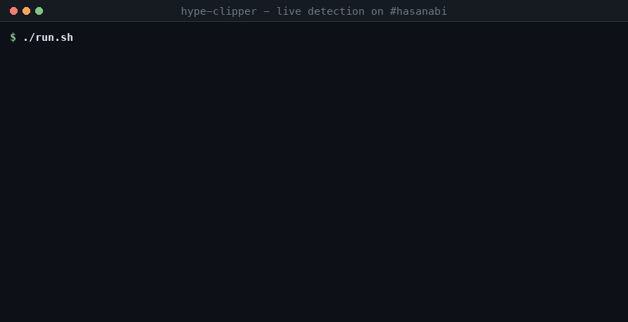

# Live Twitch Hype-Spike Clipper

Watches a live Twitch channel's chat, notices the moment chat loses it, and cuts a real Twitch clip of the last ~30 seconds — then drops the link in Discord. Detection lands within a second of the burst; the rest is however long Twitch takes to render the clip.



> Replace `docs/demo.gif` with a screen recording: streamer hits a big play → console logs the spike → clip link lands in Discord → click it and it plays.

## How it works

```
Twitch IRC (websocket)  ->  Kafka  ->  spike detector  ->  dedup lock  ->  dispatcher
   anonymous, read-only     buffer     Redis ZSET          Redis SETNX      |-> Twitch Clip API
                                                                            |-> Discord webhook
                                                                            |-> Postgres audit
```

- **Ingest** — anonymous IRC-over-WebSocket connection (`justinfan` login, no OAuth needed to read). Answers Twitch's PINGs, reconnects when the socket drops.
- **Buffer** — chat is published to a Kafka topic keyed by channel. The socket reader's only job is keeping up with Twitch; if detection slows down it backs up in Kafka instead of stalling the read loop.
- **Detect** — a 30-second sliding window of message timestamps in a Redis sorted set. Spike = the last 5 seconds carry at least 3× the message rate of the 25 seconds before them.
- **Dedup** — a `SETNX` lock per channel, because a spike is a wall of messages and every one of them looks like a spike.
- **Dispatch** — clip creation runs on a virtual thread, so a 15-second clip poll never blocks chat ingestion.
- **Audit** — one row per acted-on spike in Postgres, so there's a history to query.

## Running it

```bash
docker compose up -d                  # redis, postgres, kafka

cp .env.example .env                  # then fill it in
set -a && source .env && set +a

./gradlew bootRun
```

Everything except the Twitch credentials is optional to get started — with no `TWITCH_USER_TOKEN` it detects spikes and alerts, it just doesn't clip. Point it at a different channel with `--hype.channel=someone_else`, and if you want to watch the path fire on a quiet chat, loosen the thresholds:

```bash
./gradlew bootRun --args='--hype.channel=xqc --hype.min-messages=3 --hype.spike-multiplier=1.2'
```

### Getting a clip token

Clip creation needs a **user** access token with the `clips:edit` scope — an app token will not work. The Twitch CLI does the browser dance for you:

```bash
twitch token -u -s 'clips:edit'
```

These expire after a few hours, so re-run it before a demo.

### Querying the audit log

```sql
SELECT channel, recent_count, clip_url, detected_at
FROM hype_spikes
ORDER BY detected_at DESC
LIMIT 20;
```

## Engineering notes

**The clip window governs the whole design.** Twitch clips are retroactive — creation captures roughly the last 30 seconds ending when you call the API, and you can only do it while the stream is live. That single fact is why detection has to be fast, why clip creation is asynchronous and polled, and why the dedup lock exists. If the pipeline lags 20 seconds behind chat, the moment has already rolled out of the window and you clip the aftermath instead of the play.

**The baseline was eating the spike.** The first version compared the last 5 seconds against the average of the full 30-second window — but those 5 seconds are *inside* that window, so a spike inflated its own baseline and the ratio never cleared 3×. It missed exactly the loudest moments, which are the ones worth clipping. The baseline is now the 25 seconds *before* the recent slice.

**Everything looks like a spike when you've just started.** On the first run against a live channel it fired on essentially every message: with an empty window there's no baseline, so the first burst of chat is infinitely louder than the nothing before it. It now sits out one full window before it will call anything.

**Two API calls were sitting on the critical path.** Resolving the channel login to a numeric broadcaster ID and checking whether it was live meant two round trips before the POST that actually mattered — inside a window measured in seconds. The ID is resolved once at startup and cached, and the offline case already announces itself as the 404 the error handling covers.

**Failure modes worth knowing** — creation 404s on an offline channel or one with clips disabled; 429 is a *global* rate limit shared across every developer using the endpoint, which is the other reason for the dedup lock; the clip's `url` field stays blank for the first few seconds after creation, so it's polled rather than read once; and user tokens expire after a few hours and come back as 401.

**On Kafka:** at this volume a single channel's chat is a few hundred messages a minute and an in-process queue would do. It's here as a durability and replay buffer between ingestion and processing, and it decouples the socket reader from detection — a reasonable shape to grow into with many channels, not something this scale strictly requires.
